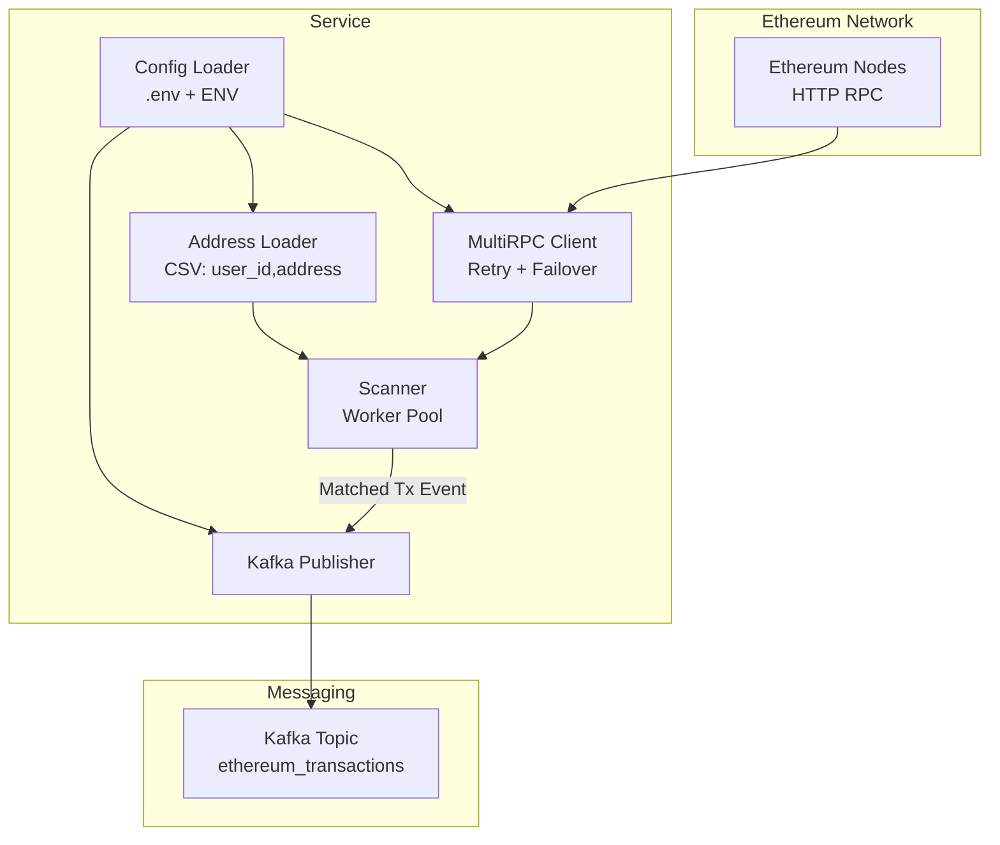
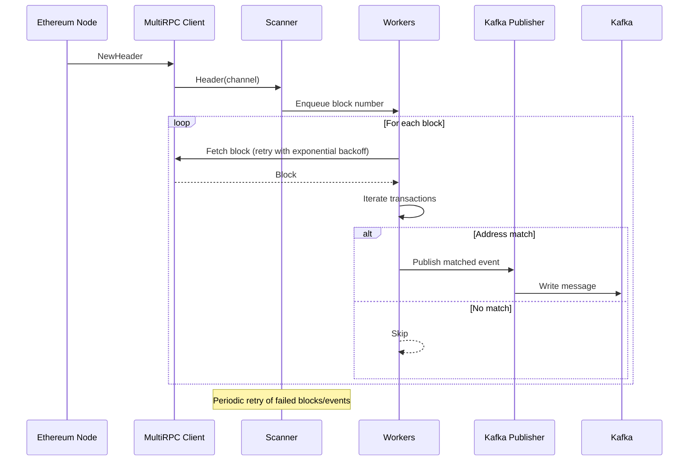

### ETH Monitor

A Go service that monitors Ethereum blocks in real time, matches transactions against a provided set of user ethereum addresses and publishes matched events to Kafka.

## Overview

- **What it does**: Subscribes to new Ethereum block headers, fetches each block, scans transactions and emits a Kafka event when either the `from` or `to` address matches a known user address.
- **How it connects**: Uses a multi-endpoint RPC client with retry-and-failover to connect and process blocks, and Kafka for downstream messaging.

## Architecture Overview



### Key Components

- **Config Loader (`internal/config`)**: Reads environment variables (optionally from `.env`) and validates required settings.
- **Address Loader (`internal/service/address.go`)**: Validates a CSV of `user_id,address`, enforcing UUID user IDs and EIP-55-compatible hex addresses. UUID's were used to avoid predicatibility and collision issues.
- **Ethereum Client (`internal/transport/ethereum`)**:
  - `RPCClient`: Thin wrapper around `go-ethereum`'s `ethclient`.
  - `MultiRPCClient`: Wraps multiple RPCClients to add resiliency. Each request is retried with exponential backoff (100ms, 200ms, 400ms, …) up to maxRetries and if retries fail, it fails over to the next configured RPC endpoint.
- **Scanner (`internal/service/scanner.go`)**: Subscribes to new node heads, fetches blocks, scans transactions concurrently and enqueues matched events for publishing. It maintains retry queues for failed block fetches and failed event publishes.
- **Kafka Publisher (`internal/transport/tkafka`)**: Creates `kafka.Writer` per topic and publishes messages keyed by `user_id`.

## Processing Blocks

1. **Subscribe to block headers**  
   Scanner listens for new block headers via Ethereum RPC WSS. Duplicate or older headers are ignored.  

2. **Enqueue into worker pool**  
   Block numbers are queued and distributed across worker goroutines for concurrent processing. 

3. **Fetch and process block**  
   Workers fetch blocks with a timeout, decode transactions, and extract `from` / `to` ethereum addresses and values.  

4. **Match and publish**  
   If an ethereum address matches a known user, a JSON event (`userId, from, to, amount, hash, blockNumber`) is published to Kafka. Failed publishes are stored and retried.  

5. **Handle failures**  
   Block fetch errors are logged and recorded for retry. Background workers periodically reprocess failed blocks and republish failed kafka events.



## Installation & Quick Start

### Prerequisites
- Go 1.21+
- Access to at least one Ethereum RPC endpoint via wss:// (WebSockets only, e.g. Infura, Alchemy, etc.)
- Kafka (local via Docker Compose or existing cluster)

### Clone
```bash
git clone <this-repo>
cd eth-monitor
```

### Start Kafka (local)
```bash
docker-compose up -d
```

### Configure environment
Create a `.env` file. You can use the example below:
```bash

# Path to the CSV with Ethereum user addresses
USER_ADDRESS_FILE=user_addresses.csv # I will leave the file at this path

# RPC endpoint for Ethereum node (requires websockets)
RPC_URLS=wss://mainnet.infura.io/ws/v3/<key>,wss://mainnet.infura.io/ws/v3/<key> # Update this with your RPC endpoints (wss)
RPC_TIMEOUT=30s
RETRY_INTERVAL=30s
NODE_RETRY_ATTEMPTS=3

# Worker pool settings
WORKER_THREADS=5
TRANSACTION_BUFFER=2000

# Kafka connection
KAFKA_BROKERS=localhost:9092
KAFKA_TOPIC=eth.tx.matches
KAFKA_ACKS=all
KAFKA_AUTO_CREATE=true
KAFKA_ASYNC=false
KAFKA_BATCH_BYTES=1048576
KAFKA_BATCH_SIZE=100
KAFKA_BATCH_TIMEOUT=10ms
PUBLISH_RETRY_ATTEMPTS=2
```

### Run
```bash
go run cmd/service/main.go
```

## Configuration

All configuration is via environment variables (loaded from `.env` if present):

- **USER_ADDRESS_FILE**: Path to CSV of addresses (default: `user_addresses.csv`)
- **RPC_URLS**: Comma-separated RPC wss URLs (e.g. `wss://...,wss://...`) [required]
- **WORKER_THREADS**: Number of concurrent block workers (default: `3`)
- **TRANSACTION_BUFFER**: Buffered channel size for headers/work (default: `1000`)

- **KAFKA_BROKERS**: Comma-separated brokers (e.g. `localhost:9092`) [required]
- **KAFKA_TOPIC**: Topic for matched events (default: `ethereum_transactions`)
- **KAFKA_ACKS**: one|all|none (default: `all`)
- **KAFKA_AUTO_CREATE**: Auto-create topic if missing (default: `true`)
- **KAFKA_ASYNC**: Asynchronous writes (default: `false`)
- **KAFKA_BATCH_BYTES**: Max batch bytes (optional)
- **KAFKA_BATCH_SIZE**: Max messages per batch (optional)
- **KAFKA_BATCH_TIMEOUT**: Max linger per batch (e.g. `10ms`)

- **RPC_TIMEOUT**: Per-request timeout (default: `10s`)
- **RETRY_INTERVAL**: Interval for retry workers to handle failed events (default: `30s`)
- **NODE_RETRY_ATTEMPTS**: Attempts per RPC call before failover (default: `2`)
- **NODE_RETRY_BASE_DELAY**: Exponential backoff base (e.g. `100ms`)

Config validation ensures required fields are present and numeric values are correct.

## Addresses CSV Format

- Header must be exactly: `user_id,address` (in this order)
- `user_id`: valid UUID (v4 or compatible)
- `address`: Ethereum hex address, `0x`-prefixed, 40 hex chars
- Empty rows and `#`-prefixed comment lines are ignored

Example:
```csv
user_id,address
550e8400-e29b-41d4-a716-446655440000,0xdAC17F958D2ee523a2206206994597C13D831ec7
2b1f3d6a-5b0c-4c64-88a3-2d1a8b0d2a10,0x742d35Cc6634FDb0532C9E4db8C0E7E0e5c4b1B8
```

## Event Schema

Published to Kafka as JSON (keyed by `user_id`):
```json
{
  "userId": "550e8400-e29b-41d4-a716-446655440000",
  "from": "0x...",
  "to": "0x...", 
  "amount": "1.2345", 
  "hash": "0xabc...",
  "blockNumber": 18500000
}
```
- `amount` is a decimal string in ETH derived from the transaction `value` in wei.
- `to` is omitted for contract creations.

## Project Structure

```
eth-monitor/
  cmd/service/               # Service entrypoint
  internal/config/           # Env config loader + validation
  internal/models/           # Models
  internal/service/          # Scanner, address loader and interfaces
  internal/transport/
    ethereum/                # RPC and multi-RPC clients
    tkafka/                  # Kafka publisher
  docker-compose.yml         
  user_addresses.csv         # Sample input file
```

## Observability

This service logs with `slog` and maintains in-memory retry queues for failed operations. It does not expose HTTP health or metrics endpoints yet.

How monitoring could be improved:
- Add Prometheus metrics for blocks processed, matches emitted and retry queue depths.
- Add health endpoints.

## Edge Case Handling

This service includes several built-in resilience mechanisms to handle failure scenarios:

### RPC Failover & Retry
- **Problem**: Single-node RPC setups are fragile and may fail under load or downtime.  
- **Solution**: Use multiple RPC endpoints with automatic failover and exponential backoff.  
- **Implementation**: `MultiRPCClient` rotates between endpoints after configurable retries (`NODE_RETRY_ATTEMPTS`), backing off requests exponentially (100ms, 200ms, 400ms...).  

### Block Processing Resilience
- **Problem**: Block fetches can fail due to network errors or node instability.  
- **Solution**: Retry failed blocks in the background without blocking new block processing.  
- **Implementation**: Failed block numbers are stored in a retry queue and reprocessed by background workers at configurable intervals (`RETRY_INTERVAL`).  

### Event Publishing Resilience
- **Problem**: Kafka publish failures risk permanent event loss.  
- **Solution**: Capture failed events and retry them in the background.  
- **Implementation**: Events are stored in an in-memory retry queue and retried periodically.  

### Worker Pool & Concurrency
- **Problem**: Processing every block sequentially would create bottlenecks under load.  
- **Solution**: Distribute work across a pool of concurrent workers.  
- **Implementation**: A configurable number of worker threads process blocks concurrently using buffered channels for backpressure handling.  

### Network & Timeout Handling
- **Problem**: RPC calls may hang indefinitely or block shutdown.  
- **Solution**: Apply timeouts and context cancellation for network operations.  
- **Implementation**: RPC requests use a configurable timeout (`RPC_TIMEOUT`), and the scanner shuts down with proper cleanup.  

## Future Improvements for Edge Case Handling

While this service includes retry and failover mechanisms, production deployments could consider these additional resilience patterns:

### Block Reorganization (Chain Reorgs)
- **Problem**: Ethereum can reorganize chains, making previously confirmed blocks invalid
- **Solution**: Wait for N confirmations (12-15 blocks) before processing to reduce reorg risk
- **Implementation**: Add configurable confirmation depth and block hash validation

### Extended Node Downtime
- **Problem**: All RPC endpoints unavailable for extended periods
- **Solution**: Store last processed block number persistently and backfill missed blocks after reconnection
- **Implementation**: Replace in-memory state with database/file storage

### Transaction Loss Prevention
- **Problem**: Network failures, timeouts or memory pressure causing dropped events
- **Solution**: Use persistent storage for retry queues instead of in-memory storage
- **Implementation**: Store failed blocks and events in Redis/database with proper recovery procedures

